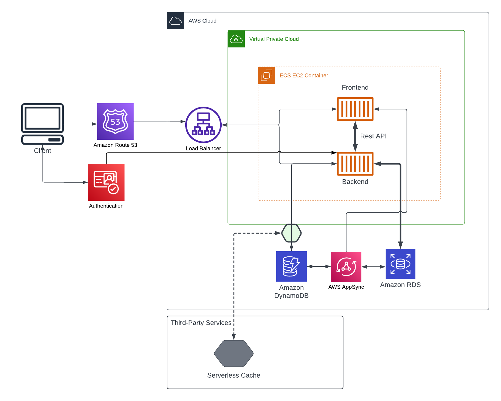
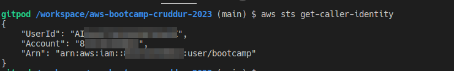
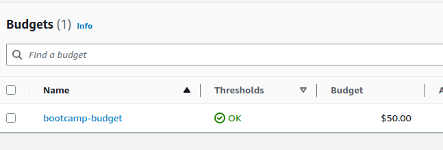
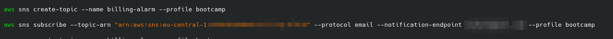
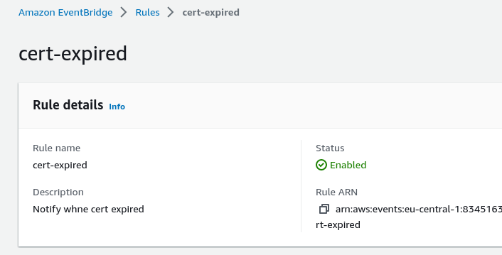
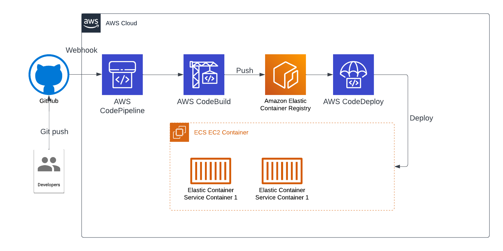

# Week 0 — Billing and Architecture

## Tasks

 1- All checklist items watched, completed.
 
   
  a.   Logical Architectual Diagram: [Lucid Charts Share Link](https://lucid.app/lucidchart/6f80cd2d-7d18-4731-aadc-bdda9773c092/edit?invitationId=inv_c648fee2-f691-443d-8602-7e959b41a18d
)
  
   

  b. Gitpod has been configured for AWS cli, and environment variables have been imported.

    
    
  c. Budget notification created from template file.

   

  d. SNS Topic cerated. I have configured aws cli to use profiles.

   

  e. Billing Alarm cerated. I need to change the name of the alarm because I made a mistake with the metrics calculations that caused the alarm to be triggered.

   

 2- Knowledge challenges submitted.

 ## Homeworks

 1- For certificate expiration, I created an EventBridge rule. Because the AWS cli does not currently support EventBridge, I created the rule from the dashboard.

   

 2- CI/CD logical pipeline: [Lucid Charts Share Link](https://lucid.app/lucidchart/0d1a6b20-75b8-4117-9d93-e588947b7d55/edit?viewport_loc=-291%2C8%2C2597%2C920%2C0_0&invitationId=inv_74366d83-e805-4aed-ab66-5e66f695ca70)

   
  