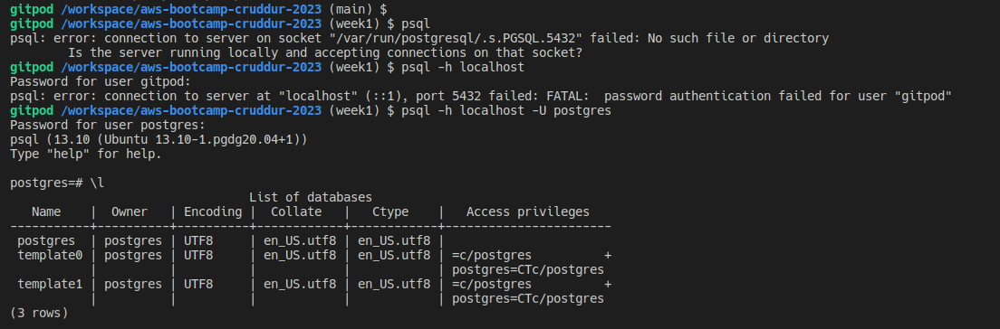
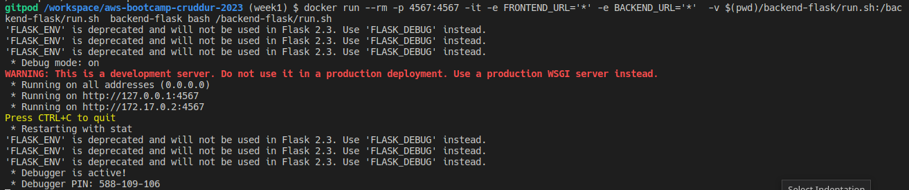
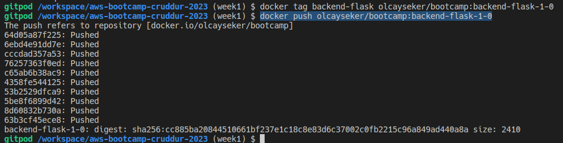

# Week 1 — App Containerization

## Containerize backend application

### install Python

Gitpod is default to Pyhton 3.8 so I followed readme file instructions to upgrade Pyhton version and run application with python. 
I learned about python virtual environments.
I got "ModuleNotFoundError:", so i run pip3 command to install prerequisites.

```
 cd backend-flask
 pip3 install -r requirements.txt
```

 

### Create Dockerfile to conatineriza backend app

I created Dockerfile and use Debian based Python image.

I built the backend application image with the command below

```sh
docker build -t  backend-flask ./backend-flask
```

I run the container and opened the exposed address address and got not found error

```sh
docker run --rm -p 4567:4567 -it -e FRONTEND_URL='*' -e BACKEND_URL='*' backend-flask
```


I checked container logs from Docker addon

I run docker build command on my local pc and pip3 could not install requirements. Solution was easy, restarting docker daemon did the trick.


## Containerize Frontend

Using the command below, I created the frontend application image. There were no issues that I faced.

```sh
docker build -t frontend-react-js ./frontend-react-js
```

## Multiple Containers

### Create a docker-compose file

Creating docker compose file was a bit compelling. For my local environment it was relatively easy but for Gitpod, i need to search for adapting URLs.

I added docker extension to gitpod.yaml and it broke completely the workspace as well as VScode it self.

I followed instructions to ensure that postgres is working.



 ## Homeworks Challenges

 ### External Script

 I added backend-flask/run.sh shell file which basically runs python3 command
 I mount related script file with volume command and run with the command below

 ```sh
 docker run --rm -p 4567:4567 -it -e FRONTEND_URL='*' -e BACKEND_URL='*'  -v $(pwd)/backend-flask/run.sh:/backend-flask/run.sh  backend-flask bash /backend-flask/run.sh
 ```

 Backend application run as usual


 
### Push and Tag Image to Dockerhub

Tag container for docker repo

```sh
docker tag backend-flask olcayseker/bootcamp:backend-flask-1-0
```

Push backend container to dockerhub.
```sh
docker push olcayseker/bootcamp:backend-flask-1-0
```



### Docker compose Healtcheck

I added those instruction in docker compose file for frontend aplication basic health check.


```   healthcheck:
      test: curl --fail http://localhost:3000 || exit 1
      interval: 60s
      retries: 5
      start_period: 20s
      timeout: 10s
      ```